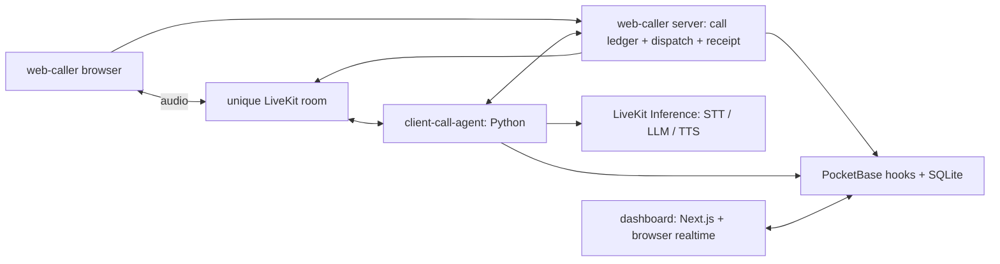

# Yoshida

**A multilingual voice assistant for independent cleaners.** Formerly CleanVoice; Yoshida is the team’s chosen name, drawn from the teammates’ names.

A hackathon voice AI prototype for independent cleaners facing a language barrier with German-speaking clients. A browser caller speaks German with an agent; the intended outcome is a tentative cleaning request that a cleaner can review in their own language.

**Status: hackathon prototype for supervised local demos.** This repository includes the caller, agent, dashboard, and PocketBase hooks/schema setup. A fresh synthetic database, booking creation, cleaner login, component tests, and one complete German browser voice request were verified. The live run used the supported Cartesia route and produced a durable `requested` booking receipt. See the [browser voice verification record](docs/browser-voice-verification.md); live provider checks remain opt-in.

## Demo flow

1. The caller app requests microphone access before any token or dispatch work.
2. The caller server creates one private call record, unique room, browser token, worker capability, and fixed submission identity, then dispatches `client-call-agent`.
3. The agent opens in German while loading caller context from PocketBase, then collects a cleaning request.
4. Its tools request cleaner preferences, suggest a match, and submit the reviewed request through the caller server, which preserves the outcome across worker loss or reload.
5. The authenticated dashboard reads bookings and receives realtime refreshes from PocketBase; the cleaner reviews the result.

The backend creates requests with `requested` status regardless of a caller-supplied status. The owning cleaner can Confirm or Decline a reviewed request in the dashboard; the decision is persisted through the authenticated booking API. The local setup checks exercise booking tools and dashboard reads; they do not establish live speech quality, translation accuracy, or suitability for real customer data.

## Architecture



| Directory | Responsibility |
| --- | --- |
| `web-caller/` | Next.js caller UI, microphone/audio lifecycle, call ledger, LiveKit dispatch, and receipt recovery |
| `client-call-agent/` | Python LiveKit worker, German conversation prompt, PocketBase HTTP tools |
| `dashboard/` | Next.js cleaner login, bookings, calendar, preferences, and realtime client |
| `pocketbase/` | Schema setup, synthetic cleaner seed, HTTP hooks, and localization helpers |
| `docs/` | Setup, backend contract, and demo screenshot |
| `design/` | Fictional design references |

The dashboard does not join the LiveKit room. The historical `agent/` and `web-cleaner/` names correspond to `client-call-agent/` and `dashboard/`. PocketBase binaries and runtime data are excluded.

## Team

Yoshida was built together by [David Guerra](https://github.com/david-guerra), [lishiiChan](https://github.com/lishiiChan), and [younaorg](https://github.com/younaorg) for the telli × LiveKit hackathon.

The Python worker began from [LiveKit's agent starter](https://github.com/livekit-examples/agent-starter-python), and the frontends began from Next.js scaffolds. The conversation rules, PocketBase integration, caller flow, and cleaner UI are the project-specific layers. See [third-party notices](THIRD_PARTY_NOTICES.md).

## Run locally

Use Node.js 24 and npm, Python 3.12, and [uv](https://docs.astral.sh/uv/). From a fresh clone:

```sh
git clone https://github.com/david-guerra/Yoshida.git
cd Yoshida
npm --prefix dashboard ci
npm --prefix web-caller ci
cd client-call-agent
uv sync --frozen --dev --python 3.12
cd ..
```

Verify the independent components without provider credentials:

```sh
npm --prefix dashboard test
npm --prefix dashboard run lint
npm --prefix dashboard run build
npm --prefix web-caller test
npm --prefix web-caller run lint
npm --prefix web-caller run build
cd client-call-agent
uv run --frozen pytest -q
uv run --frozen ruff check .
uv run --frozen ruff format --check .
cd ..
node --test pocketbase/tests/*.test.mjs
python3 -m unittest discover -s pocketbase/tests -p 'test_booking*http.py' -v
```

Dashboard tests exercise booking creation, paginated reads, account isolation, date validation, and realtime recovery through controlled transport boundaries; some frontend checks inspect source contracts. Agent tests cover prompt construction, provider configuration, call capabilities, and HTTP tool boundaries with test doubles; three live model evaluations are opt-in. Caller tests cover cancellation, unique dispatch, ambiguous save recovery, receipt persistence, and bounded lifecycle exits. The booking HTTP suites require the PocketBase 0.39.4 binary described in [setup](docs/setup.md#fresh-synthetic-backend) and start their own disposable databases. See the [read and realtime verification record](docs/booking-read-verification.md) and [browser voice verification record](docs/browser-voice-verification.md). Automated checks alone do not establish speech quality or production readiness. Dependency installation needs network access; frontend builds do not require provider credentials.

For local UI startup, environment configuration, and the conditional live demo, follow [setup](docs/setup.md). The caller UI can render without credentials; placing a call requires a configured LiveKit project. The dashboard login renders without PocketBase; signing in and reading bookings require the local backend and synthetic account described in the setup guide.

## Media

Dashboard capture from a disposable synthetic PocketBase database, taken before the Yoshida rename (the interface shown still says Cleaner Desk). The third booking appeared through realtime without a reload; this is not a recording of a live voice call.


The [media inventory](design/README.md) also records the historical design concept.

## Limitations and boundaries

- Browser audio simulates a call; no checked-in SIP/PSTN telephone integration exists.
- The caller uses fresh rooms and random scoped capabilities, but it has no end-user account, rate limiting, multi-instance call ledger, or public deployment hardening. Run it on loopback for supervised demos.
- Caller lookup and briefing routes remain unauthenticated and custom routes have no rate limits. Booking decisions require the owning cleaner; collection reads are owner-filtered and direct booking writes are locked. Keep the backend on loopback with disposable synthetic data.
- Requests route to the explicitly configured active cleaner and warn about a low budget; this does not establish availability, location, or service matching. Booking creation is transactional, and retries with the same submission identity and reviewed payload return the original tentative receipt.
- Audio, text, and tool context can reach configured inference providers. Retention, recording consent, deletion, and approved voice use have not been established for real callers.
- Translations need native-speaker review, especially Polish, Ukrainian, and Arabic. There is no production matching or availability guarantee. The prototype has no production reliability or security assurance.

## License

MIT, with shared credit to David Guerra, lishiiChan, younaorg, and Yoshida contributors. See [LICENSE](LICENSE). Upstream source notices, provider terms, and voice/model rights are separately documented in [third-party notices](THIRD_PARTY_NOTICES.md).

[Security guidance](SECURITY.md)
