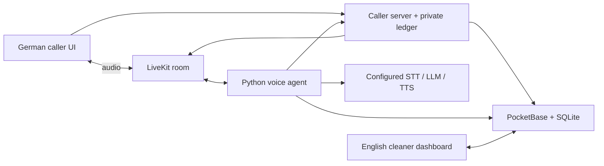

# Yoshida

**A German-speaking voice front desk for independent cleaners.** A caller describes a cleaning job in the browser; Yoshida saves a tentative request for the cleaner to review in English and then confirm or decline. Built as a team hackathon prototype by [David Guerra](https://github.com/david-guerra), [lishiiChan](https://github.com/lishiiChan), and [younaorg](https://github.com/younaorg).

| Current interface | At a glance |
| --- | --- |
| <br>*Reconstructed from a saved fictional call after hang-up; the receipt does not update after the cleaner's decision. No live speech is pictured. [Gallery and capture notes](docs/showcase.md#application-gallery).* | **Status:** supervised, synthetic **local** demo. Two German browser calls produced distinct persisted requests; the owning cleaner confirmed one and declined the other. A later Node.js 24 call exercised receipt recovery after hang-up during saving. The user accepted this combined evidence; the stricter [#40 acceptance gate](https://github.com/david-guerra/Yoshida/issues/40) remains open.<br><br>**Components:** [German caller](web-caller/) · [voice agent](client-call-agent/) · [PocketBase backend](pocketbase/) · [English cleaner dashboard](dashboard/).<br><br>**Run and test:** [exact fresh-clone commands below](#run-locally).<br><br>**Boundary:** browser calls, one configured cleaner, fictional data, loopback services; no public hosted demo or production assurance.<br><br>**CI:** [latest checked main run passed on 23 September 2026](https://github.com/david-guerra/Yoshida/actions/runs/35841078346); this branch needs its own run after publication. |

[Observed demo evidence and limits](docs/integrated-acceptance-verification.md#demo-acceptance-and-formal-limits). There is no telephone integration or availability matching.

## Run locally

Use Node.js **24**, Python **3.12**, npm, [uv](https://docs.astral.sh/uv/), and the official [PocketBase 0.39.4 binary](https://github.com/pocketbase/pocketbase/releases/tag/v0.39.4) at `pocketbase/pocketbase`. From a fresh clone:

```sh
git clone https://github.com/david-guerra/Yoshida.git
cd Yoshida
npm --prefix dashboard ci
npm --prefix web-caller ci
uv sync --directory client-call-agent --frozen --dev --python 3.12
uv run --directory client-call-agent --frozen python ../scripts/local_demo.py --without-worker
```

The last command starts a new private synthetic database and both UIs on loopback, then prints their addresses. Its generated cleaner password is in the private `login.json` it names. `--without-worker` allows UI review without a speech provider; it cannot place a voice call. For an optional real browser voice demo, configure your own LiveKit project as in [setup](docs/setup.md) and [run the launcher with its worker](docs/integrated-acceptance.md#start-a-private-stack). Use fictional details only. The launcher does not publish the app.

From the repository root, verify the components:

```sh
npm --prefix dashboard test
npm --prefix dashboard run lint
npm --prefix dashboard run build -- --webpack
npm --prefix web-caller test
npm --prefix web-caller run lint
npm --prefix web-caller run build -- --webpack
uv run --directory client-call-agent --frozen pytest -q
uv run --directory client-call-agent --frozen ruff check .
uv run --directory client-call-agent --frozen ruff format --check .
node --test pocketbase/tests/*.test.mjs
python3 -m unittest discover -s pocketbase/tests -p 'test_booking*http.py' -v
uv run --directory client-call-agent --frozen python -m unittest discover -s ../scripts/tests -v
python3 -m py_compile pocketbase/setup_pb.py scripts/local_demo.py scripts/verify_demo_booking.py
```

The PocketBase HTTP suites start disposable databases and require the 0.39.4 binary. The local build commands use webpack because this managed host blocks Turbopack's internal port binding. GitHub [CI](.github/workflows/ci.yml) runs default frontend builds plus tests/lint, agent tests/Ruff, and PocketBase JavaScript tests/compile; the HTTP and launcher suites are local checks. [Fresh-clone verification for this showcase](docs/showcase.md#verification) records the commands actually run and any environment limits.

## Journey and architecture

1. The caller grants microphone access before the caller server creates a private call record and unique LiveKit room.
2. The agent gathers a German cleaning request, reads the configured cleaner's preferences, repeats the details, and asks for explicit approval.
3. The caller server and PocketBase save one `requested` booking with a fixed submission identity. A duplicate retry returns the same tentative receipt; an uncertain result is reconciled before starting another request.
4. The signed-in cleaner sees a realtime request, reviews the original and translated details, and persists a Confirm or Decline decision. Confirmation does not invent an agreed price.



The dashboard never joins the audio room. [Backend contract](docs/backend-contract.md) describes transactions, authorization, time zones, and recovery. [The gallery](docs/showcase.md#application-gallery) shows the real current interfaces with fictional persisted records and labels reconstructed or staged states.

## Team and provenance

Yoshida is the shared work of [David Guerra](https://github.com/david-guerra), [lishiiChan](https://github.com/lishiiChan), and [younaorg](https://github.com/younaorg) for the telli × LiveKit hackathon. Its name was chosen from the teammates' names. David's later commits in this repository integrated the booking submission and owner-decision contract, browser receipt recovery, cleaner reads and UI, and the local verification harness. The original hackathon work remains credited to the team; no new teammate-specific roles are assigned here.

The Python worker began from [LiveKit's agent starter](https://github.com/livekit-examples/agent-starter-python), and both frontends began from Next.js scaffolds. The conversation rules, booking integration, caller flow, and cleaner experience are project-specific work. See [MIT license](LICENSE) and [third-party notices](THIRD_PARTY_NOTICES.md).

## Limitations and boundaries

- The caller has no customer account or public admission controls. The call ledger is local to one instance. Backend lookup and briefing routes are unauthenticated and lack rate limits. Run the stack on loopback with disposable data.
- A request targets the configured active cleaner. The budget warning is informational; there is no availability, geography, or service matching guarantee. Only the owning cleaner can decide a booking.
- Configured inference providers may receive audio, text, and tool context. Real-caller consent, retention, deletion, and approved voice use are not established. Translation quality needs native-speaker review.
- [Formal #40 acceptance](docs/integrated-acceptance-verification.md#demo-acceptance-and-formal-limits) still lacks a repeated two-call decision run on the final candidate and several accessibility observations. A static screenshot cannot establish speech quality.
- A public synthetic demo would need a separate implementation and verification of the [#32 internet-access gate](https://github.com/david-guerra/Yoshida/issues/32); none is deployed. [Showcase media decision](docs/showcase.md#media-decision).

[Security guidance](SECURITY.md)
