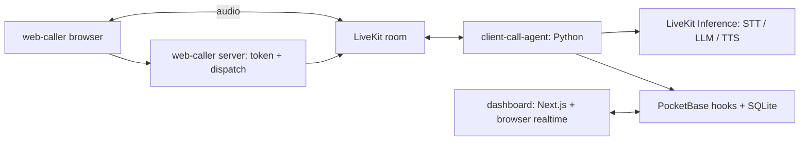
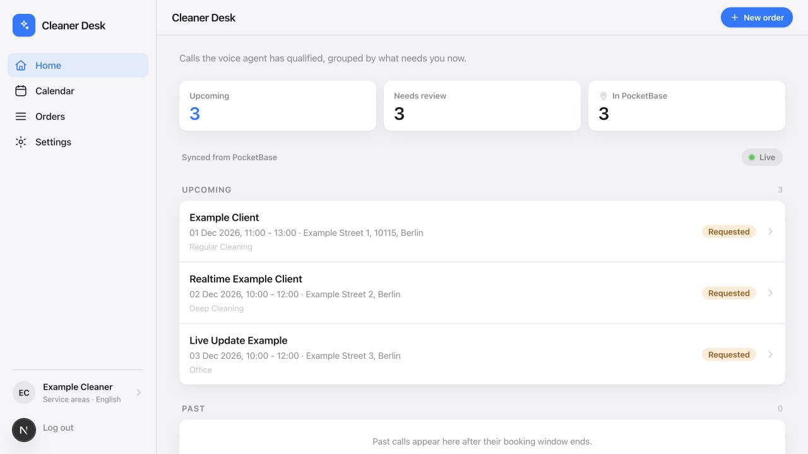

# Yoshida

**A multilingual voice assistant for independent cleaners.** Formerly CleanVoice; Yoshida is the team’s chosen name, drawn from the teammates’ names.

A hackathon voice AI prototype for independent cleaners facing a language barrier with German-speaking clients. A browser caller speaks German with an agent; the intended outcome is a tentative cleaning request that a cleaner can review in their own language.

**Status: hackathon prototype for supervised local demos.** This repository includes the caller, agent, dashboard, and PocketBase hooks/schema setup. A fresh synthetic database, booking creation, cleaner login, and component tests have been verified. Live voice calls were not revalidated: they require your own provider account and a supported TTS route. See the [current gateway limitation](docs/setup.md#optional-live-voice-demo); live model evaluations are opt-in.

## Demo flow

1. The caller app requests microphone access and a server-minted LiveKit token for `demo-call`.
2. The server dispatches the `client-call-agent` worker with a synthetic caller identity.
3. The agent opens in German while loading caller context from PocketBase, then collects a cleaning request.
4. Its tools request cleaner preferences, suggest a match, and submit a tentative booking.
5. The authenticated dashboard reads bookings and receives realtime refreshes from PocketBase; the cleaner reviews the result.

The backend creates requests with `requested` status regardless of a caller-supplied status. Human confirmation is required outside this prototype; a confirmation action is not implemented in the dashboard. The local setup checks exercise booking tools and dashboard reads; they do not establish live speech quality, translation accuracy, or suitability for real customer data.

## Architecture



| Directory | Responsibility |
| --- | --- |
| `web-caller/` | Next.js caller UI, microphone access, LiveKit token signing and dispatch |
| `client-call-agent/` | Python LiveKit worker, German conversation prompt, PocketBase HTTP tools |
| `dashboard/` | Next.js cleaner login, bookings, calendar, preferences, and realtime client |
| `pocketbase/` | Schema setup, synthetic cleaner seed, HTTP hooks, and localization helpers |
| `docs/` | Setup, backend contract, privacy review, and publication gates |
| `design/` | Team-approved fictional design references |

The dashboard does not join the LiveKit room. The historical `agent/` and `web-cleaner/` names correspond to `client-call-agent/` and `dashboard/`. PocketBase binaries and runtime data are excluded. Earlier planning documents describe the hackathon's evolving design; this README describes the checked-in layout.

## Team

Yoshida was built together by [David Guerra](https://github.com/david-guerra), [lishiiChan](https://github.com/lishiiChan), and [younaorg](https://github.com/younaorg) for the telli × LiveKit hackathon.

The Python worker began from [LiveKit's agent starter](https://github.com/livekit-examples/agent-starter-python), and the frontends began from Next.js scaffolds. The conversation rules, PocketBase integration, caller flow, and cleaner UI are the project-specific layers. See [third-party notices](THIRD_PARTY_NOTICES.md).

## Run locally

Use Node.js 24 and npm, Python 3.12, and [uv](https://docs.astral.sh/uv/). From a fresh clone:

```sh
git clone https://github.com/david-guerra/Yoshida.git
cd Yoshida
npm --prefix dashboard ci
npm --prefix web-caller ci
cd client-call-agent
uv sync --frozen --dev --python 3.12
cd ..
```

Verify the independent components without provider credentials:

```sh
npm --prefix dashboard test
npm --prefix dashboard run lint
npm --prefix dashboard run build
npm --prefix web-caller test
npm --prefix web-caller run lint
npm --prefix web-caller run build
cd client-call-agent
uv run --frozen pytest -q
uv run --frozen ruff check .
uv run --frozen ruff format --check .
cd ..
node --test pocketbase/tests/*.test.mjs
```

The frontend tests mostly inspect source contracts. Agent tests cover prompt construction and HTTP tool boundaries with test doubles; three live model evaluations are opt-in. They do not establish end-to-end or production readiness. Dependency installation needs network access; frontend builds do not require provider credentials.

For local UI startup, environment configuration, and the conditional live demo, follow [setup](docs/setup.md). The caller UI can render without credentials; placing a call requires a configured LiveKit project. The dashboard login renders without PocketBase; signing in and reading bookings require the local backend and synthetic account described in the setup guide.

## Media

Dashboard capture from a disposable synthetic PocketBase database, taken before the Yoshida rename (the interface shown still says Cleaner Desk). The third booking appeared through realtime without a reload; this is not a recording of a live voice call.



The [media inventory](design/README.md) also records the team-approved historical design concept.

## Limitations and boundaries

- Browser audio simulates a call; no checked-in SIP/PSTN telephone integration exists.
- The caller uses a fixed room and participant identity. Its token and dispatch routes have no authentication or rate limiting. Run them on loopback for supervised demos; do not expose a credentialed caller publicly.
- The custom PocketBase routes have no authentication or rate limits. The setup grants every authenticated user access to all base collections; tenant isolation is absent. Keep the backend on loopback with disposable synthetic data.
- Cleaner matching is a demo stub that selects the first available record and only warns about a low budget; it does not implement full availability, location, or service matching. Booking writes are nontransactional and retries may duplicate records.
- Audio, text, and tool context can reach configured inference providers. Retention, recording consent, deletion, and approved voice use have not been established for real callers.
- Translations need native-speaker review, especially Polish, Ukrainian, and Arabic. There is no production matching or availability guarantee. The prototype has no production reliability or security assurance.

## Publication and license

MIT, with shared credit to David Guerra, lishiiChan, younaorg, and Yoshida contributors. See [LICENSE](LICENSE). Upstream source notices, provider terms, and voice/model rights are separately documented in [third-party notices](THIRD_PARTY_NOTICES.md).

[Showcase audit and remaining gates](docs/showcase-audit.md) · [Security guidance](SECURITY.md) · [Active cleanup issue](https://github.com/david-guerra/Yoshida/issues/2)
