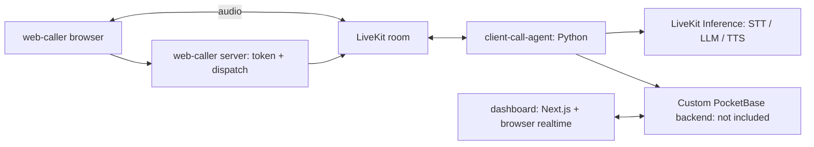

# CleanVoice

A hackathon voice AI prototype for independent cleaners facing a language barrier with German-speaking clients. A browser caller speaks German with an agent; the intended outcome is a tentative cleaning request that a cleaner can review in their own language.

**Status: prototype; showcase preparation is still open.** This repository contains the caller, agent, and dashboard. The custom PocketBase backend used by the demo is missing, so a fresh clone cannot reproduce the complete call-to-booking flow yet. Offline checks and frontend builds can run independently.

## Demo flow

1. The caller app requests microphone access and a server-minted LiveKit token for `demo-call`.
2. The server dispatches the `client-call-agent` worker with a synthetic caller identity.
3. The agent preloads caller context from PocketBase, opens in German, and collects a cleaning request.
4. Its tools request cleaner preferences, suggest a match, and submit a tentative booking.
5. The authenticated dashboard reads bookings and attempts realtime refreshes from PocketBase; the cleaner reviews the result.

This describes the implemented integration and intended demo. A successful build is not proof of a working backend, realtime subscription, translation, or live voice call. The agent prompt requires human confirmation; that is a conversational constraint, not a verified enforcement mechanism in the missing backend.

## Architecture



| Directory | Responsibility |
| --- | --- |
| `web-caller/` | Next.js caller UI, microphone access, LiveKit token signing and dispatch |
| `client-call-agent/` | Python LiveKit worker, German conversation prompt, PocketBase HTTP tools |
| `dashboard/` | Next.js cleaner login, bookings, calendar, preferences, and realtime client |
| `docs/` | Setup, backend contract, privacy review, and publication gates |
| `design/` | Historical design references; provenance and display rights await confirmation |

The dashboard does not join the LiveKit room. There is no checked-in `agent/`, `web-cleaner/`, or PocketBase implementation. Earlier planning documents describe the hackathon's evolving design; this README describes the checked-in layout.

## Team and contribution

CleanVoice was built together by [David Guerra](https://github.com/david-guerra), [lishiiChan](https://github.com/lishiiChan), and [younaorg](https://github.com/younaorg) for the telli × LiveKit hackathon.

David built the voice agent; his teammates built the frontend and backend. David subsequently worked across both to integrate and refine the demo. The result is shared team work. The team has agreed to publication and cleanup.

The Python worker began from [LiveKit's agent starter](https://github.com/livekit-examples/agent-starter-python), and the frontends began from Next.js scaffolds. The conversation rules, PocketBase integration, caller flow, and cleaner UI are the project-specific layers. See [third-party notices](THIRD_PARTY_NOTICES.md).

## Run locally

Use Node.js 24 and npm, Python 3.12, and [uv](https://docs.astral.sh/uv/). From a fresh clone:

```sh
git clone https://github.com/david-guerra/CleanVoice.git
cd CleanVoice
npm --prefix dashboard ci
npm --prefix web-caller ci
cd client-call-agent
uv sync --frozen --dev --python 3.12
cd ..
```

Verify the independent components without provider credentials:

```sh
npm --prefix dashboard test
npm --prefix dashboard run lint
npm --prefix dashboard run build
npm --prefix web-caller test
npm --prefix web-caller run lint
npm --prefix web-caller run build
cd client-call-agent
uv run --frozen pytest -q
uv run --frozen ruff check .
uv run --frozen ruff format --check .
```

The frontend tests mostly inspect source contracts. Agent tests cover prompt construction and HTTP tool boundaries with test doubles; three live model evaluations are opt-in. They do not establish end-to-end or production readiness. Dependency installation and the dashboard's Google font build need network access.

For local UI startup, environment configuration, and the conditional live demo, follow [setup](docs/setup.md). The caller UI can render without credentials; placing a call requires a configured LiveKit project. The dashboard login renders without PocketBase; signing in and reading bookings require the missing backend and an authorized test account.

## Media

No verified call recording or end-to-end demo screenshot is published here. The files in `design/` are **design mockups**, not proof of working features; see the [media inventory](design/README.md). Replace these with permission-cleared captures using synthetic records after the backend is restored.

## Limitations and boundaries

- Browser audio simulates a call; no checked-in SIP/PSTN telephone integration exists.
- The caller uses a fixed room and participant identity. Its token and dispatch routes have no authentication or rate limiting. Run them on loopback for supervised demos; do not expose a credentialed caller publicly.
- The agent's custom PocketBase requests have no service authentication. Backend access rules, tenant isolation, input validation, and booking confirmation enforcement cannot be assessed without that code.
- Dashboard auth depends on PocketBase rules; optional superuser configuration is not a substitute for least-privilege user authorization.
- Audio, text, and tool context can reach configured inference providers. Retention, recording consent, deletion, and approved voice use have not been established for real callers.
- Translation quality, matching accuracy, availability checks, and realtime behavior require a new integration test. The prototype has no production reliability or security assurance.

## Publication and license

There is no project-wide license grant yet. MIT is proposed for the team to adopt; the final license choice remains open; the upstream starter notice applies only to its covered code. Do not infer rights to team assets, provider voices, or models from the repository being public.

[Showcase audit and remaining gates](docs/showcase-audit.md) · [Security guidance](SECURITY.md) · [Active cleanup issue](https://github.com/david-guerra/CleanVoice/issues/2)
