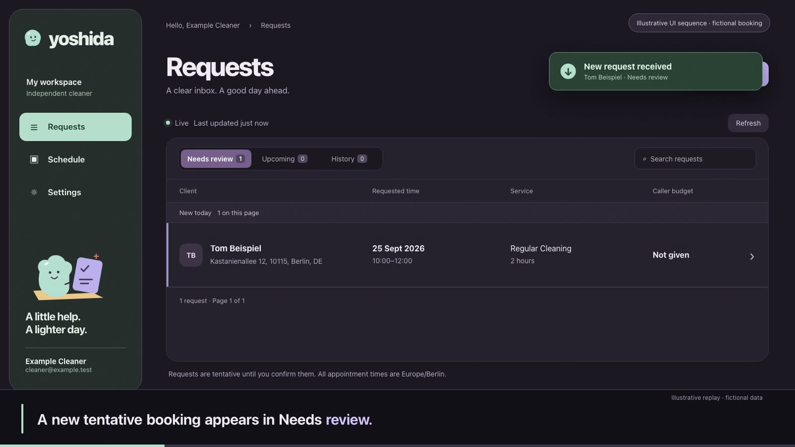

# Yoshida

**Yoshida is a German-speaking voice agent for independent cleaners.** It gathers a cleaning request, reads the details back for approval, and saves a tentative booking. The cleaner reviews it in English and chooses Confirm or Decline. Today, a browser simulates the incoming call; a real phone connection is [future work](https://github.com/david-guerra/Yoshida/issues/33).

**Built by:** [@david-guerra](https://github.com/david-guerra) · [@lishiiChan](https://github.com/lishiiChan) · [@younaorg](https://github.com/younaorg)

[See the current app](docs/showcase.md#application-gallery) · [Read the demo evidence](docs/integrated-acceptance-verification.md#demo-acceptance-and-formal-limits) · [Run it locally](#run-locally)

## Watch the demo

<a href="https://github.com/david-guerra/Yoshida/raw/refs/heads/main/docs/media/yoshida-silent-demo.mp4"></a>

**[▶ Open or download the 58-second silent video](https://github.com/david-guerra/Yoshida/raw/refs/heads/main/docs/media/yoshida-silent-demo.mp4)** · [Timed subtitles (WebVTT)](docs/media/yoshida-silent-demo.vtt)

The animated booking and cleaner decision are an illustrative replay using fictional data, with no voice track. The ending shows an [actual app capture](docs/showcase.md#persisted-owner-decisions-from-the-spoken-calls) from the verified local demo.

**What works today:** In a supervised local demo, two separate German conversations with the voice agent created persisted requests. The cleaner confirmed one and declined the other. Repeatability and accessibility checks remain under [#40](https://github.com/david-guerra/Yoshida/issues/40).

**Prototype scope:** One configured cleaner, fictional data, and local services. There is no phone connection or public demo.

[](https://github.com/david-guerra/Yoshida/actions/workflows/ci.yml)

## How it works

| Part | Role in the demo |
| --- | --- |
| [Voice agent](client-call-agent/) | Speaks German, reads cleaner context, gathers the request, and asks for caller approval. |
| [Booking backend](pocketbase/) | Stores each tentative request and the cleaner's later decision. |
| [Cleaner dashboard](dashboard/) | Shows the request in English for review, confirmation, or decline. |
| [Browser call simulator](web-caller/) | Supplies audio and caller identity while the phone connection is unimplemented; its local server handles dispatch and save recovery. |

The agent sends an approved request through the local call server to PocketBase. A repeated submission returns the same tentative receipt, and an uncertain save is reconciled before another request. The dashboard receives updates without joining the audio room. [Backend contract](docs/backend-contract.md) covers the technical details.

## Run locally

Use Node.js **24**, Python **3.12**, npm, [uv](https://docs.astral.sh/uv/), and the official [PocketBase 0.39.4 binary](https://github.com/pocketbase/pocketbase/releases/tag/v0.39.4) at `pocketbase/pocketbase`. From a fresh clone:

```sh
git clone https://github.com/david-guerra/Yoshida.git
cd Yoshida
npm --prefix dashboard ci
npm --prefix web-caller ci
uv sync --directory client-call-agent --frozen --dev --python 3.12
```

For a supervised **voice-agent demo**, configure your own LiveKit project and speech providers as in [setup](docs/setup.md), then run:

```sh
uv run --directory client-call-agent --frozen python ../scripts/local_demo.py
```

This starts a new private synthetic database and both UIs on loopback, plus a local voice worker connected to your configured LiveKit project. The browser simulates an incoming call; use fictional details only. The launcher prints the addresses and a private `login.json` containing the generated cleaner password. The [runbook](docs/integrated-acceptance.md#start-a-private-stack) covers the checks and provider requirements. No phone number is connected and the app is not published.

For **interface-only review** without a speech provider, use the same launcher with `--without-worker`:

```sh
uv run --directory client-call-agent --frozen python ../scripts/local_demo.py --without-worker
```

This shows the dashboard and browser simulator but cannot run the agent or place a voice call.

## Verify

From the repository root, verify the components:

```sh
npm --prefix dashboard test
npm --prefix dashboard run lint
npm --prefix dashboard run build -- --webpack
npm --prefix web-caller test
npm --prefix web-caller run lint
npm --prefix web-caller run build -- --webpack
uv run --directory client-call-agent --frozen pytest -q
uv run --directory client-call-agent --frozen ruff check .
uv run --directory client-call-agent --frozen ruff format --check .
node --test pocketbase/tests/*.test.mjs
python3 -m unittest discover -s pocketbase/tests -p 'test_booking*http.py' -v
uv run --directory client-call-agent --frozen python -m unittest discover -s ../scripts/tests -v
python3 -m py_compile pocketbase/setup_pb.py scripts/local_demo.py scripts/verify_demo_booking.py
```

The PocketBase HTTP suites start disposable databases and require the 0.39.4 binary. The local build commands use webpack because this managed host blocks Turbopack's internal port binding. GitHub [CI](.github/workflows/ci.yml) runs default frontend builds plus tests/lint, agent tests/Ruff, and PocketBase JavaScript tests/compile; the HTTP and launcher suites are local checks. [Fresh-clone verification](docs/showcase.md#verification) records the commands actually run and any environment limits.

## Limitations and boundaries

- The browser simulator has no customer account or public admission controls. Its call ledger is local to one instance. Backend lookup and briefing routes are unauthenticated and lack rate limits. Run the stack on loopback with disposable data.
- A request targets the configured active cleaner. The budget warning is informational; there is no availability, geography, or service matching guarantee. Only the owning cleaner can decide a booking.
- Configured inference providers may receive audio, text, and tool context. Real-caller consent, retention, deletion, and approved voice use are not established. Translation quality needs native-speaker review.
- [Formal #40 acceptance](docs/integrated-acceptance-verification.md#demo-acceptance-and-formal-limits) still lacks a repeated two-call decision run on the final candidate and several accessibility observations. The stills and silent illustrated video cannot establish speech quality.
- A public synthetic demo would need a separate implementation and verification of the [#32 internet-access gate](https://github.com/david-guerra/Yoshida/issues/32); none is deployed. [Showcase media decision](docs/showcase.md#media-decision).

[Security guidance](SECURITY.md) · [MIT license](LICENSE) · [Third-party notices](THIRD_PARTY_NOTICES.md)
