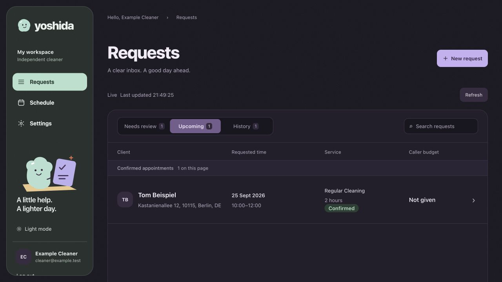
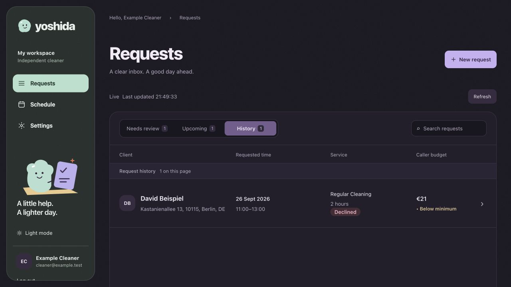
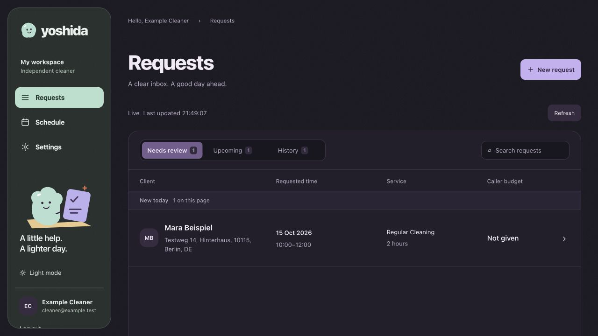
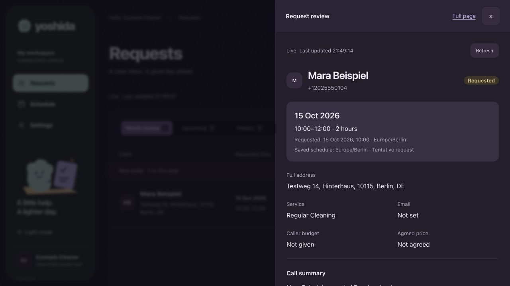
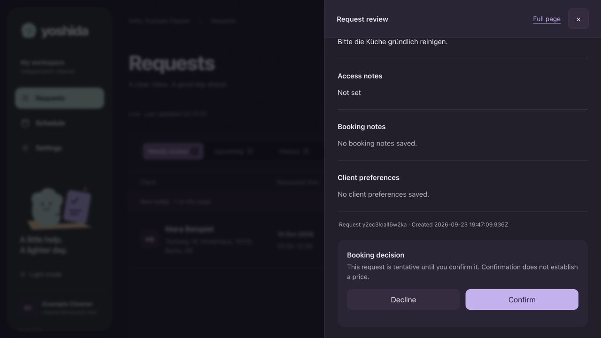
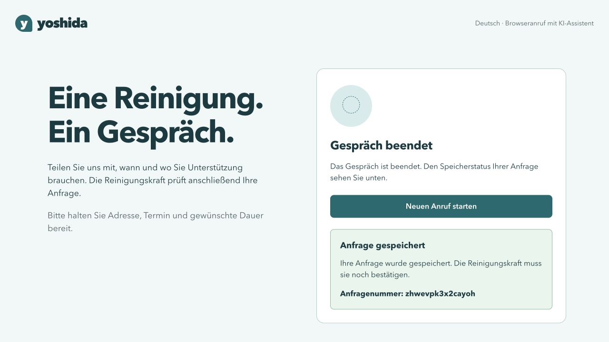
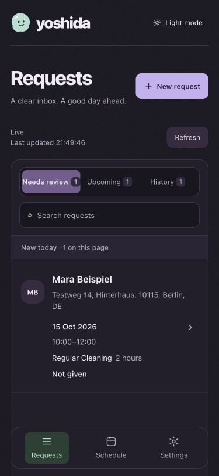

# Yoshida showcase: gallery and media decision

This portfolio guide shows recruiters and hiring reviewers the synthetic local voice-agent prototype. The browser caller simulates the intended phone entry point; no telephone integration exists yet. The [integrated acceptance record](integrated-acceptance-verification.md) documents the spoken calls and persisted checks; these still images establish only what the running application rendered. All names, addresses, phone numbers, and appointments shown are fictional.

## Application gallery

The cleaner dashboard displays the requests produced by the voice agent. The browser view below is the local call simulator used to exercise that agent.

### Persisted owner decisions from the spoken calls

These two records are copies of the verified fictional German calls in [#40's run](integrated-acceptance-verification.md#fresh-live-german-browser-run): `zhwevpk3x2cayoh` was confirmed and `8pgqd6bsb7rvphl` was declined by the owner. The gallery shows their persisted dashboard states after the calls, not the action being clicked live. The €21 budget was below the configured €50 minimum but did not reject the request automatically.

### English cleaner: tentative inbox and review

The `Mara Beispiel` request was **staged through the real manual form and backend** on a disposable copy of the acceptance database. It is a persisted tentative request, not the result of a voice call. The two review images show different scroll positions of the same drawer; no decision was taken on this staged record.

### German browser call simulator: original tentative receipt

This current simulator UI was reconstructed on 23 September 2026 from a **copy** of [#40 call A's](integrated-acceptance-verification.md#fresh-live-german-browser-run) saved ledger and PocketBase database. Its browser capability was reissued only in the disposable copy so the actual saved receipt `zhwevpk3x2cayoh` could be displayed again. The receipt remains tentative by design even though the owner later confirmed that booking. This is not a contemporaneous recording of the spoken call. No new provider call was made for this image.

### Narrow view

The same staged manual request at 375×812 shows the running mobile layout. The formal accessibility observations and remaining gaps are in the [acceptance record](integrated-acceptance-verification.md#demo-acceptance-and-formal-limits).

## Media decision

| Criterion | Captioned short video | Static app gallery | Hosted synthetic demo |
| --- | --- | --- | --- |
| Clarity | Shows German speech and handoff in one minute, with cuts marked. | Shows exact saved UI states; cannot establish speech or realtime arrival. | Lets reviewers explore the flow themselves. |
| Reviewer effort | Watch 45–60 seconds and read captions. | Scan images and captions, with links to evidence. | Start a call and follow a longer interactive flow. |
| Upkeep | Rerecord and recaption after flow changes. | Recapture images after UI changes. | Operate and monitor a live service. |
| Cost | Provider use, recording, editing, and captioning. | Low one-time capture and repository storage. | Hosting, operations, and speech providers. |
| Accessibility | Requires accurate captions and transcript. | Alt text and adjacent explanations; no audio barrier. | Needs tested keyboard, screen-reader, and audio paths. |
| Privacy | Recording a participant's voice needs consent and a retention plan; staged synthetic audio could avoid real participant voice. | Fictional screenshots expose no participant voice. | Public entry needs admission controls, isolation, and data handling. |
| Provider dependence | A truthful fresh voice call uses configured inference providers. | Viewers need no provider or running server. | Interactive calls depend on external speech providers. |

**Choice for #44: publish the static gallery now.** It uses only fictional data and links each visible state to its provenance. There is no hosted demo or public caller invitation. A hosted option would first need a separate proposal and verified implementation with an owner, budget, admission model, isolation and abuse controls, data handling, and negative tests under [#32](https://github.com/david-guerra/Yoshida/issues/32). Public deployment is outside this ticket.

The [recruiter video follow-up #45](https://github.com/david-guerra/Yoshida/issues/45) starts after the remaining [#40 integrated demo tests](https://github.com/david-guerra/Yoshida/issues/40) are recorded. Its **captioned 45–60 second video** of the real local app should show: (1) 5 seconds of the German browser simulator starting a fictional request; (2) 20 seconds of a short, edited but clearly marked conversation with the agent and explicit spoken approval; (3) 5 seconds showing the saved *tentative* receipt; (4) 15 seconds showing the matching English cleaner review and an owner decision; (5) 5 seconds showing the persisted tab after reload and a closing local-prototype label. Capture a new fictional call, verify its booking ID against the backend, provide captions and a transcript, and identify any omitted time or reconstructed screen. Do not use the old screenshots as video frames of live speech.

## Verification

The seven screenshots were taken from the current production frontend builds at 1280×720 and 375×812 against a **disposable copy** of the accepted #40 synthetic data; the manual tentative record was saved through the dashboard in that copy. The original acceptance data and environment were not edited. The temporary browser bootstrap and all loopback servers were removed or stopped after capture. The checked-in files contain screenshots only, not the private ledger, passwords, tokens, logs, or recordings.

On 23 September 2026, a separate local Git clone of source commit `064e71f` was checked with Node.js **24.19.0**, Python **3.12.13**, uv **0.11.28**, and PocketBase **0.39.4** on macOS. The documentation and gallery edits in this ticket were checked in the working tree, because the clone was made before their commit. Both `npm ci` commands succeeded using the local npm cache; `uv sync --frozen --dev --python 3.12` downloaded and installed the locked agent dependencies. The documented no-worker launcher started a new synthetic PocketBase, caller and dashboard on unused loopback ports, reported `worker_started: false`, and shut down cleanly. No speech provider was contacted.

| Fresh-clone check | Result |
| --- | --- |
| Dashboard tests, lint, webpack production build/typecheck | 52 passed; lint and build passed |
| Caller tests, lint, webpack production build/typecheck | 26 passed; lint and build passed |
| Agent pytest, Ruff lint and format | 80 passed, 3 opt-in model checks skipped; Ruff passed |
| PocketBase JavaScript and disposable HTTP suites | 9 and 13 passed |
| Python compile of setup, launcher and verifier | Passed |
| Launcher integration suite | First full run: 2 of 3 passed; one teardown hit a managed-host `killpg` permission error after its UI checks. A focused rerun of the two launcher tests passed. The process-cleanup test had passed in the full run. |

The default Turbopack production build failed in this managed shell while trying to bind an internal port (`Operation not permitted`). Both frontends then built and typechecked with the documented `--webpack` fallback. This is a host restriction, not a successful default-build result. The [#46 PR CI run](https://github.com/david-guerra/Yoshida/actions/runs/36025326740) passed all four jobs on 24 September 2026, and [main CI after the merge](https://github.com/david-guerra/Yoshida/actions/runs/36025477220) also passed. Those GitHub runs include the default frontend builds.

The previous [#40 run](integrated-acceptance-verification.md#automated-evidence) remains separate speech and persistence evidence; these fresh-clone checks did not repeat a live call.

The repository's GitHub description and topics were checked against this scope; no change was needed. The former pre-rename dashboard image was removed. The new JPEGs contain no EXIF, IPTC, or XMP metadata, and the checked-in documentation and media contain no private credentials or call recordings.
